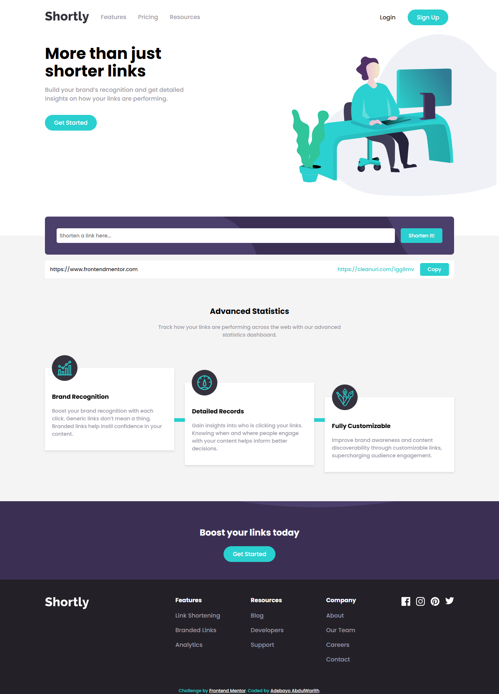
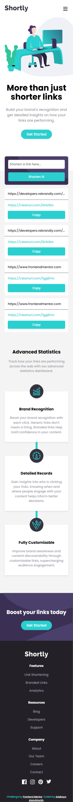
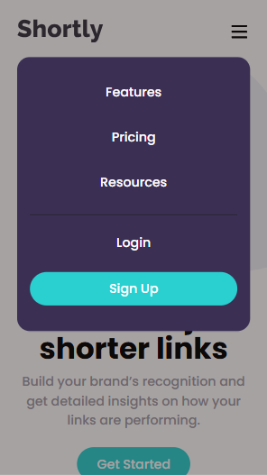

# Frontend Mentor - Shortly URL shortening API Challenge solution

This is a solution to the [Shortly URL shortening API Challenge challenge on Frontend Mentor](https://www.frontendmentor.io/challenges/url-shortening-api-landing-page-2ce3ob-G). Frontend Mentor challenges help you improve your coding skills by building realistic projects.

## Table of contents

- [Overview](#overview)
  - [The challenge](#the-challenge)
  - [Screenshot](#screenshot)
  - [Links](#links)
- [My process](#my-process)
  - [Built with](#built-with)
  - [What I learned](#what-i-learned)
  - [Continued development](#continued-development)
- [Author](#author)
- [Acknowledgments](#acknowledgments)

## Overview

### The challenge

Users should be able to:

- View the optimal layout for the site depending on their device's screen size
- Shorten any valid URL
- See a list of their shortened links, even after refreshing the browser
- Copy the shortened link to their clipboard in a single click
- Receive an error message when the `form` is submitted if:
  - The `input` field is empty

### Screenshot





### Links

- Solution URL: [solution URL](https://www.frontendmentor.io/solutions/coded-using-reactjsx-and-css-VBsRdKaIuR)
- Live Site URL: [Live on Vercel](https://url-shortening-api-wale.vercel.app/)

## My process

### Built with

- Semantic HTML5 markup
- CSS custom properties
- Flexbox
- Mobile-first workflow
- [React](https://reactjs.org/) - JS library

### What I learned

I learned a lot in this project, as this is my first project using React and JSX, I learned that, when using <code>useState()</code> the state updates asynchronously, so it needs to be carefully used. Moreover, i learned that if your new state depends on the previous state, you should use the functional update form...

```React
useState();
useEffect();
```

### Continued development

I'm trying to learn how, where and when to use "Side Effect", other hooks and all react has to offer.

## Author

- Website - [vercel](https://www.vercel.com/bigwhale001s-projects)
- Frontend Mentor - [@BIGWHALE-dev](https://www.frontendmentor.io/profile/BIGWHALE-dev)
- Twitter - [@adebayowarith86](https://www.twitter.com/yourusername)

## Acknowledgments

My brother helped me a lot in this project where and when i'm having a major problem, and he's been an inspiration and hope of "better days ahead" from the very first step till now...
